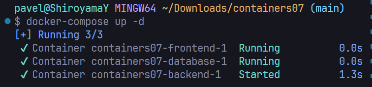
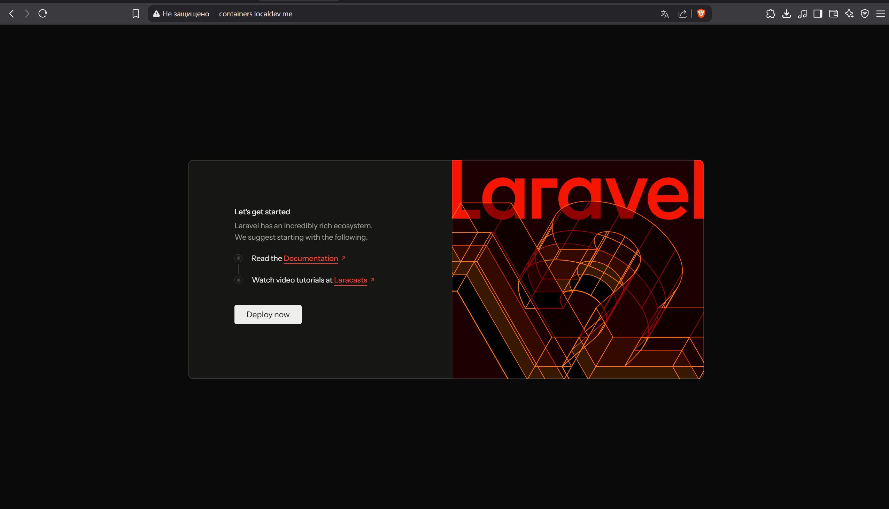

# Отчет по лабораторной работе IWNO7: Создание многоконтейнерного приложения

## Цель работы
Ознакомиться с работой многоконтейнерного приложения на базе **docker-compose**.

## Задание
Создать php приложение на базе трех контейнеров: **nginx**, **php-fpm**, **mariadb**, используя docker-compose.

## Описание выполнения работы

### 1. Подготовка репозитория

1. Создал репозиторий `containers07` на GitHub

### 2. Подготовка директории для **PHP-сайта**

1. Создал директорию для сайта:
   ```bash
   mkdir -p mounts/site
   ```
2. Скопировал PHP-сайт из работы containers06 в `mounts/site/` в моем случае **laravel 12**

### 3. .gitignore

Создал файл `.gitignore` с содержимым:
```
# Ignore files and directories
mounts/site/*
```

### 4. Добавить конфиг **Nginx**

1. Создал директорию для конфигурации **Nginx**:
   ```bash
   mkdir nginx
   ```
2. Создал файл `nginx/default.conf` со следующей конфигурацией:
```
server {
    listen 80;
    server_name containers.localdev.me;
    root /var/www/html/public;
    index index.php;
    location / {
        try_files $uri $uri/ /index.php?$args;
    }
    location ~ \.php$ {
        fastcgi_pass backend:9000;
        fastcgi_index index.php;
        fastcgi_param SCRIPT_FILENAME $document_root$fastcgi_script_name;
        include fastcgi_params;
    }
}
```

- **Примечание**, **server_name** я поменял для удобства **localdev.me** ссылается на **localhost**

3. Изменил **root** на **/var/www/html/public**, так как в моем случае входная точка **laravel** приложения находится в данной директории

### 5. Написание **docker-compose.yml**

Создаю файл **docker-compose.yml** с данной конфигурацией, с следующим содержимым:

- Сервис **frontend** (nginx)
- Сервис **backend** (php-fpm) (на базе образа с php версией 8.2 для laravel)
- Сервис **database** (mysql) (на базе образа mysql8.0)
- Настройки **сети и томов** (необходимо создать сеть internal и том для хранения данных mysql)

### 6. Настройка переменных окружения

Создал файл **mysql.env** с переменными для базы данных:

```
MYSQL_ROOT_PASSWORD=secret
MYSQL_DATABASE=app
MYSQL_USER=user
MYSQL_PASSWORD=secret
```

### Шаг 7: Запуск приложения

Запустил контейнеры командой:

```bash
docker-compose up -d
```


- Данная команды выполняет все необходимые команды из докер компос, тоесть создает необходимые сети, тома, и собирает контейнеры из указаных готовых образов или билдит исходя из указаного контекста

- флаг -d указывает что запускать нужно в detach режиме

### Шаг 8: Проверка работы

1. Открываю браузер и перехожу по адресу http://containers.localdev.me


2. Убедился, что сайт работает корректно

## Ответы на вопросы

1. **В каком порядке запускаются контейнеры?**  
   Docker-compose запускает контейнеры в порядке зависимостей, если они указаны при помощи depend on, если нет то в произвольном порядке так как docker compose без depends_on ничего не гарантирует.

2. **Где хранятся данные базы данных?**  
   Данные базы данных хранятся в томе `db_data`, который указан в разделе volumes файла docker-compose.yml.  Данный том ссылается на директорию /var/lib/mysql внутри контейнера.

3. **Как называются контейнеры проекта?**  
   По умолчанию контейнеры называются по шаблону: `<имя_директории_проекта>_<имя_сервиса>_<номер>`. Например: `containers07_frontend_1`, `containers07_backend_1`, `containers07_database_1`.

Пример из запуска контейнера:

4. **Как добавить файл app.env с переменной APP_VERSION?**  
Нужно:

1. Создать файл `app.env` в корне проекта с содержимым:
    ```
    APP_VERSION=1.0
    ```

2. Изменить docker-compose.yml, добавив env_file для соответствующих сервисов, в данном случае я добавляю для обоих сервисов frontend(nginx) и backend(phpfpm):
    ```yaml
    frontend:
    env_file:
        - app.env
    ```

    ```yaml
    backend:
    env_file:
        - app.env
        - mysql.env
    ```

## Выводы
В ходе лабораторной работы я научился:

- Создавать многоконтейнерные приложения с помощью docker-compose
- Настраивать взаимодействие между контейнерами (nginx, php-fpm, mysql) c помощью docker compsoe
- Управлять переменными окружения в docker-compose
- Настраивать volumes для сохранения данных в docker compose
- Создавать сети контейнеров при помощи докер compose

Использование docker-compose значительно упрощает развертывание сложных приложений, состоящих из нескольких сервисов, и позволяет легко управлять их конфигурацией.